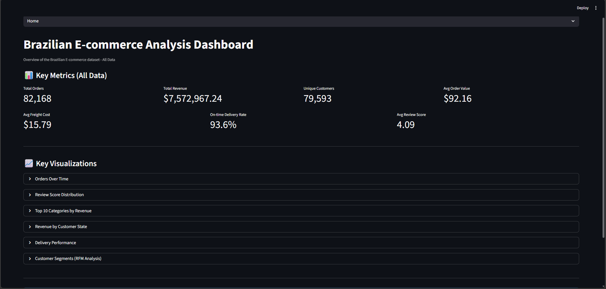
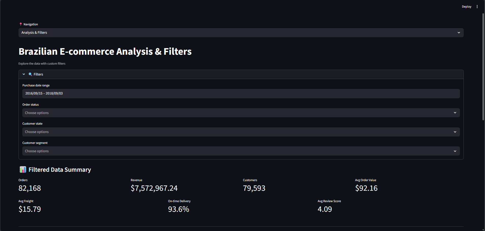
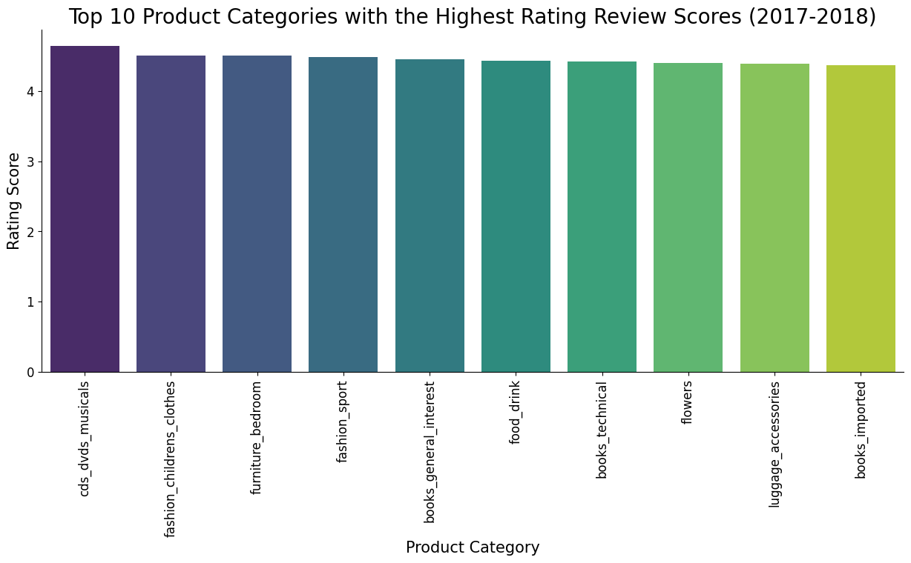
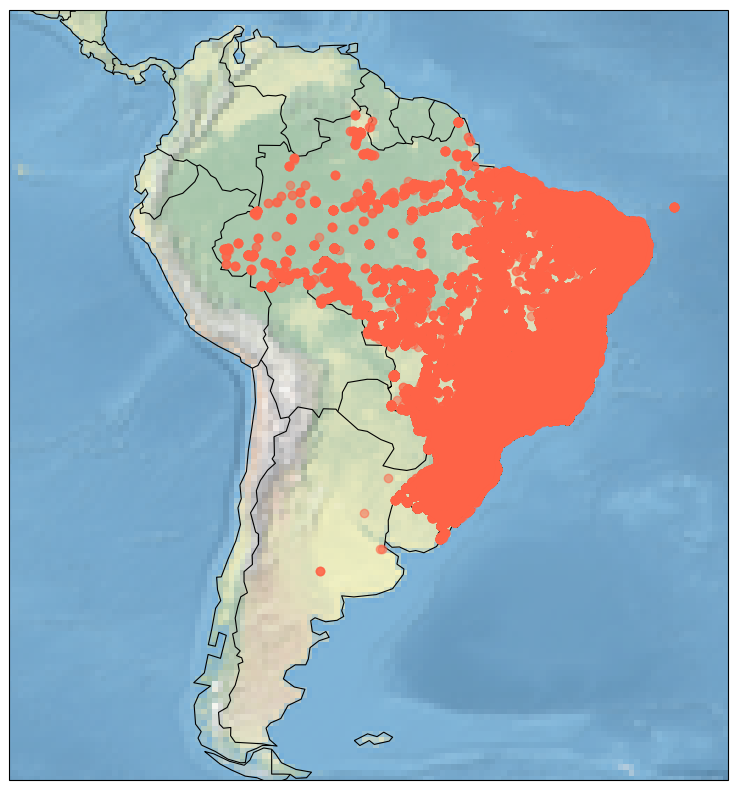

# Brazilian E-commerce Data Analysis

End-to-end analytics project built on Olist Brazilian e-commerce data, from raw-data auditing and preprocessing to business analysis and an interactive Streamlit dashboard.

## Why This Project Matters

This project demonstrates practical analytics execution across the full lifecycle:

1. Data quality auditing on real, messy transactional data.
2. Reproducible cleaning and dataset integration pipeline.
3. Exploratory and business-focused analysis.
4. Dashboard delivery for stakeholder-friendly decision support.

## Portfolio Highlights

- Built a multi-source retail analytics pipeline across customers, orders, items, payments, reviews, products, sellers, and geolocation.
- Produced analysis-ready datasets from raw files and exported reusable processed tables.
- Implemented business analysis including delivery performance, category performance, customer profile, and RFM segmentation.
- Delivered an interactive dashboard with KPIs, filters, and visual storytelling.

## Data Source

The raw files in Data/Raw follow the Olist schema (for example, olist_customers_dataset.csv and olist_orders_dataset.csv), commonly distributed as the Brazilian E-Commerce Public Dataset by Olist on Kaggle.

Dataset reference:
- https://www.kaggle.com/datasets/olistbr/brazilian-ecommerce

## Project Structure

- Data/Raw: Original source files.
- Data/Processed: Cleaned, merged, and dashboard-ready datasets.
- Notebooks: Data understanding, cleaning, geospatial work, and EDA.
- module/plotMissingValues.py: Missing-value visualization helper.
- Dashboard.py: Streamlit application.
- Requirements.txt: Project dependencies.

## End-to-End Workflow

### 1) Data Understanding and Quality Assessment

Notebook: Notebooks/Understanding_Data.ipynb

Work completed:
- Loaded all core raw tables.
- Performed data profiling (shape, schema, nulls, duplicates).
- Created a structured data quality assessment covering data types, missingness, duplicates, and outliers/inconsistencies.

### 2) Cleaning and Standardization

Notebook: Notebooks/Understanding_Data.ipynb

Work completed:
- Corrected inconsistent data types (for example ZIP code columns treated as strings).
- Normalized date and timestamp fields for orders and reviews.
- Reduced duplication issues (especially geolocation records).
- Applied missing-value handling where needed.
- Consolidated order-item structure for quantity and value analysis.
- Treated selected numeric outliers (for example payment values).

### 3) Data Integration

Notebook: Notebooks/Understanding_Data.ipynb

Merge sequence:
- Orders + Order_items_consolidated to create transaction-level sales base.
- Added product information.
- Added category translation metadata.

### 4) Processed Data Export

Notebook: Notebooks/Understanding_Data.ipynb

Exported outputs in Data/Processed include:
- customers_data_cleaned.csv
- geolocation_data_cleaned.csv
- order_items_data_cleaned.csv
- orders_data_cleaned.csv
- payments_data_cleaned.csv
- reviews_data_cleaned.csv
- products_data_cleaned.csv
- sellers_data_cleaned.csv
- sales_data_merged.csv

Dashboard-ready files also include:
- all_data_dashboard.csv
- sales_by_category.csv
- sales_by_state.csv
- rfm_segments.csv

## Notebooks Explained

### 1) Notebooks/Understanding_Data.ipynb

Focus:
- Data audit and preprocessing foundation.

Includes:
- Quality assessment summary.
- Table-by-table cleaning and type corrections.
- Duplicate, missing-value, and outlier handling.
- Multi-table merge pipeline.
- Final export of cleaned/merged datasets.

### 2) Notebooks/Geolocation.ipynb

Focus:
- Geospatial data exploration.

Includes:
- Geolocation schema and quality checks.
- State and city distribution exploration.
- Latitude/longitude plotting.
- Brazil map visualization with Cartopy for spatial context.

### 3) Notebooks/EDA.ipynb

Focus:
- Business analysis and insight generation.

Includes:
- Product analysis (price, freight, quantity, shipping duration by category).
- Payment behavior analysis (payment type distribution).
- Customer profile analysis (city/state concentration).
- Review analysis by category.
- Seller performance analysis.
- Business question analysis:
  - Top categories by review score in 2017-2018.
  - On-time delivery performance.
  - Customer demographic profile.
  - Customer purchasing behavior and RFM analysis.

## Results and Key Insights

1. Delivery reliability is a major customer-experience lever.

2. Category performance is not one-dimensional.

3. Demand is geographically concentrated.

4. Payment preference is concentrated in a few methods.

5. Customer value is unevenly distributed.

## Dashboard

Application file: Dashboard.py

The Streamlit app has two main pages:

### Home

- Overall KPIs on full data:
  - Total Orders
  - Total Revenue
  - Unique Customers
  - Average Order Value
  - Average Freight Cost
  - On-time Delivery Rate
  - Average Review Score
- Core visuals:
  - Orders over time
  - Review score distribution
  - Top categories by revenue
  - Revenue by customer state
  - Delivery timing distribution
  - RFM segment distribution

### Analysis and Filters

- Interactive filters:
  - Purchase date range
  - Order status
  - Customer state
  - Customer segment
- Filtered KPI refresh and chart updates.
- Reference tabs for category, state, and RFM summary tables.

## Screenshots

### Dashboard Preview

#### Home Page



#### Analysis and Filters Page



### Notebook Visuals

#### EDA: Top Categories Example



#### Geolocation Map Example



## Run Locally

### 1) Create and activate virtual environment

```bash
python -m venv .venv
.venv\Scripts\activate
```

### 2) Install dependencies

```bash
pip install -r Requirements.txt
```

### 3) Launch dashboard

```bash
streamlit run Dashboard.py
```

## Tech Stack

- Python
- Pandas
- NumPy
- Matplotlib
- Seaborn
- Cartopy
- Streamlit

## Final Outcome

This repository delivers a complete analytics product, not only exploratory charts:

- audited and cleaned source data,
- integrated analytical tables,
- business-question-driven analysis,
- customer segmentation,
- and an interactive decision-support dashboard.
